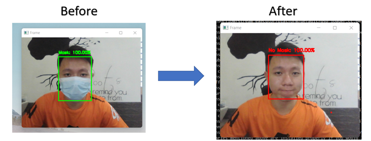

# Mask Detection with Real-Time Visualization 
 A combination of Python, MySQL and ReactJs project to detect the usage of facemask

# How it Works?
## The Python Code will be checking if a person is wearing a mask by implementing the model through the CV2 library

## The Result from the Model will be inserted and updated into the SQL database 

## The Node Js code will query the lastest row from the SQL database and display the current mask status at a particular premise

